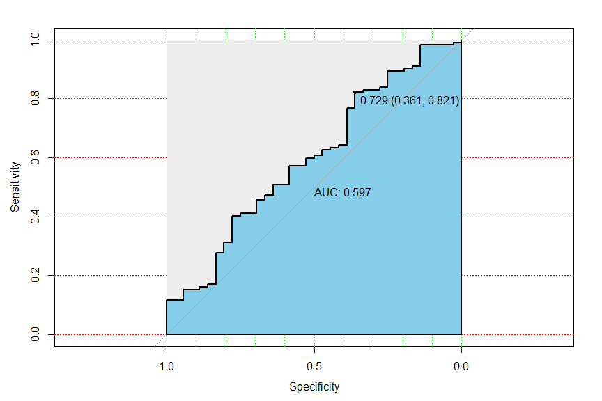

Logistic Regression
================
Peng Su
2023-12-05

## Logistic Regression

### 

``` r
set.seed(12138)

park_df =
  read_csv("ultimate data.csv") |>
  janitor::clean_names() |>
  drop_na()

logistic_df = 
  park_df |>
  mutate(
    type = as.factor(type),
    region = as.factor(region),
    country = as.factor(country),
    pandemic_level = case_when(
      year == 2019 ~ "outbreak",
      year == 2020 ~ "outbreak",
      year == 2021 ~ "outbreak",
      year == 2022 ~ "control"
    ),
    pandemic_level = as.factor(pandemic_level)
  ) 
```

``` r
logistic_df |>
  ggplot(aes(park_name, log10(attendance), color = pandemic_level)) +
  geom_point(alpha = .7) +
  facet_grid(. ~ region ) +
  labs(x = "Parks", y = "Attendance") +
  theme(axis.text.x = element_blank() )
```


``` r
cv_results = 
  logistic_df |>
  filter(region != "Worldwide") |>
  mutate(
    pandemic_level = 
      case_match(
        pandemic_level,
        "outbreak" ~ 1,
        "control" ~ 0
      )
  )

cv_df = 
  crossv_mc(
  cv_results,1
)

cv_df =
  cv_df |> 
  mutate(
    train = map(train, as_tibble),
    test = map(test, as_tibble))
```

``` r
log_mod =  
  cv_df |>
  select(train) |>
  unnest(cols = c(train)) |>
  glm(pandemic_level ~ attendance + type + region, family = "binomial", data = _)

step(log_mod, direction = "forward")
```

    ## Start:  AIC=641.74
    ## pandemic_level ~ attendance + type + region

    ## 
    ## Call:  glm(formula = pandemic_level ~ attendance + type + region, family = "binomial", 
    ##     data = unnest(select(cv_df, train), cols = c(train)))
    ## 
    ## Coefficients:
    ##                     (Intercept)                       attendance  
    ##                       2.237e+00                       -8.465e-09  
    ##                      typeMuseum                   typeWater Park  
    ##                      -8.418e-01                       -5.368e-01  
    ##                      regionEMEA  regionEurope Middle East Africa  
    ##                      -7.425e-01                       -9.508e-02  
    ##             regionLatin America              regionNorth America  
    ##                      -8.266e-01                       -4.789e-01  
    ## 
    ## Degrees of Freedom: 590 Total (i.e. Null);  583 Residual
    ## Null Deviance:       637.6 
    ## Residual Deviance: 625.7     AIC: 641.7

``` r
best_fit = log_mod

best_fit |>
  broom::tidy() |>
  knitr::kable()
```

| term                            |   estimate | std.error |  statistic |   p.value |
|:--------------------------------|-----------:|----------:|-----------:|----------:|
| (Intercept)                     |  2.2365446 | 0.3397519 |  6.5828760 | 0.0000000 |
| attendance                      |  0.0000000 | 0.0000000 | -2.0617899 | 0.0392277 |
| typeMuseum                      | -0.8417669 | 0.3303785 | -2.5478863 | 0.0108378 |
| typeWater Park                  | -0.5368024 | 0.2900213 | -1.8509072 | 0.0641829 |
| regionEMEA                      | -0.7424560 | 0.3419614 | -2.1711691 | 0.0299184 |
| regionEurope Middle East Africa | -0.0950834 | 0.3875865 | -0.2453216 | 0.8062074 |
| regionLatin America             | -0.8266498 | 0.3715557 | -2.2248340 | 0.0260924 |
| regionNorth America             | -0.4789397 | 0.2575723 | -1.8594381 | 0.0629651 |

``` r
set.seed(1)
folds <- createFolds(y=pull(cv_results, pandemic_level),k=5)###分成10份

fold_test <- cv_results[folds[[1]],]#取fold 1数据，建立测试集和验证集
fold_train <- cv_results[-folds[[1]],]

fold_pre <- glm(pandemic_level ~ attendance + type + region, family = "binomial", data = fold_train ) 
fold_predict <- predict(fold_pre,type='response',newdata=fold_test)

roc1<-roc(pull(fold_test, pandemic_level),fold_predict)
round(auc(roc1),3)##AUC
```

    ## [1] 0.597

``` r
round(ci(roc1),3)
```

    ## [1] 0.489 0.597 0.705

``` r
plot(roc1, print.auc=T, auc.polygon=T, grid=c(0.1, 0.2),
     grid.col=c("green", "red"), max.auc.polygon=T,
     auc.polygon.col="skyblue", 
     print.thres=T)
```



``` r
auc_value<-as.numeric()

for(i in 1:5){
  fold_test <- cv_results[folds[[i]],] #取folds[[i]]作为测试集
  fold_train <- cv_results[-folds[[i]],] # 剩下的数据作为训练集
  fold_pre <- glm(pandemic_level ~ attendance + type + region, family = "binomial", data = fold_train )
  fold_predict <- predict(fold_pre,type='response',newdata=fold_test)
  auc_value<- append(auc_value,as.numeric(auc(as.numeric(pull(fold_test, pandemic_level)),fold_predict)))
}

mean(auc_value)
```

    ## [1] 0.5564096
