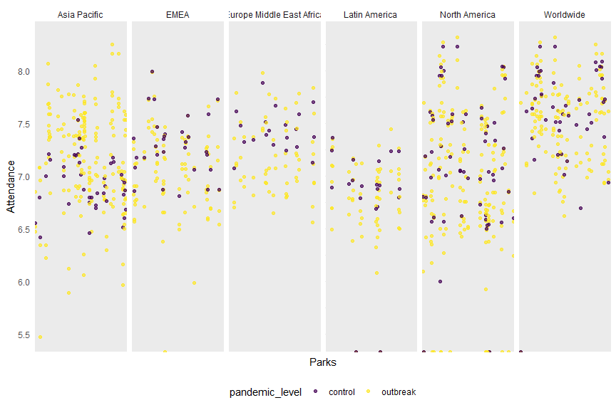

Logistic Regression
================
Peng Su
2023-12-05

``` r
set.seed(12138)

park_df =
  read_csv("ultimate data.csv") |>
  janitor::clean_names() |>
  drop_na()

logistic_df = 
  park_df |>
  mutate(
    type = as.factor(type),
    region = as.factor(region),
    country = as.factor(country),
    pandemic_level = case_when(
      year == 2019 ~ "outbreak",
      year == 2020 ~ "outbreak",
      year == 2021 ~ "outbreak",
      year == 2022 ~ "control"
    ),
    pandemic_level = as.factor(pandemic_level)
  ) 
```

``` r
logistic_df |>
  ggplot(aes(park_name, log10(attendance), color = pandemic_level)) +
  geom_point(alpha = .7) +
  facet_grid(. ~ region ) +
  labs(x = "Parks", y = "Attendance") +
  theme(axis.text.x = element_blank() )
```



``` r
cv_results = 
  logistic_df |>
  filter(region != "Worldwide") 

cv_df = 
  crossv_mc(
  cv_results,1
)

cv_df =
  cv_df |> 
  mutate(
    train = map(train, as_tibble),
    test = map(test, as_tibble))
```

``` r
log_mod =  
  cv_df |>
  select(train) |>
  unnest(cols = c(train)) |>
  glm(pandemic_level ~ attendance + type + region, family = "binomial", data = _)

step(log_mod, direction = "forward")
```

    ## Start:  AIC=641.74
    ## pandemic_level ~ attendance + type + region

    ## 
    ## Call:  glm(formula = pandemic_level ~ attendance + type + region, family = "binomial", 
    ##     data = unnest(select(cv_df, train), cols = c(train)))
    ## 
    ## Coefficients:
    ##                     (Intercept)                       attendance  
    ##                       2.237e+00                       -8.465e-09  
    ##                      typeMuseum                   typeWater Park  
    ##                      -8.418e-01                       -5.368e-01  
    ##                      regionEMEA  regionEurope Middle East Africa  
    ##                      -7.425e-01                       -9.508e-02  
    ##             regionLatin America              regionNorth America  
    ##                      -8.266e-01                       -4.789e-01  
    ## 
    ## Degrees of Freedom: 590 Total (i.e. Null);  583 Residual
    ## Null Deviance:       637.6 
    ## Residual Deviance: 625.7     AIC: 641.7

``` r
best_fit = log_mod

summary(best_fit)
```

    ## 
    ## Call:
    ## glm(formula = pandemic_level ~ attendance + type + region, family = "binomial", 
    ##     data = unnest(select(cv_df, train), cols = c(train)))
    ## 
    ## Coefficients:
    ##                                   Estimate Std. Error z value Pr(>|z|)    
    ## (Intercept)                      2.237e+00  3.398e-01   6.583 4.61e-11 ***
    ## attendance                      -8.465e-09  4.106e-09  -2.062   0.0392 *  
    ## typeMuseum                      -8.418e-01  3.304e-01  -2.548   0.0108 *  
    ## typeWater Park                  -5.368e-01  2.900e-01  -1.851   0.0642 .  
    ## regionEMEA                      -7.425e-01  3.420e-01  -2.171   0.0299 *  
    ## regionEurope Middle East Africa -9.508e-02  3.876e-01  -0.245   0.8062    
    ## regionLatin America             -8.266e-01  3.716e-01  -2.225   0.0261 *  
    ## regionNorth America             -4.789e-01  2.576e-01  -1.859   0.0630 .  
    ## ---
    ## Signif. codes:  0 '***' 0.001 '**' 0.01 '*' 0.05 '.' 0.1 ' ' 1
    ## 
    ## (Dispersion parameter for binomial family taken to be 1)
    ## 
    ##     Null deviance: 637.59  on 590  degrees of freedom
    ## Residual deviance: 625.74  on 583  degrees of freedom
    ## AIC: 641.74
    ## 
    ## Number of Fisher Scoring iterations: 4

``` r
ctrl <- trainControl(method = "cv", number = 5)

model <- train(pandemic_level ~ attendance + type + region, data = logistic_df, method = "glm", family = "binomial", trControl = ctrl)

print(model)
```

    ## Generalized Linear Model 
    ## 
    ## 920 samples
    ##   3 predictor
    ##   2 classes: 'control', 'outbreak' 
    ## 
    ## No pre-processing
    ## Resampling: Cross-Validated (5 fold) 
    ## Summary of sample sizes: 736, 736, 736, 736, 736 
    ## Resampling results:
    ## 
    ##   Accuracy   Kappa       
    ##   0.7641304  -0.004242723
