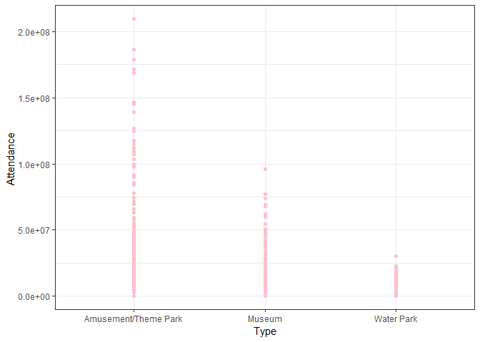

linear regression
================
2023-12-05

# Regression

## Linear Regression

Linear regression is used to model the relationship between attendance
and five independent variables (city, country, year, type, and region).
It assumes that this relationship is linear, meaning changes in the
predictors are associated with a constant change in the response. We
first fit linear regression of each predictors to check if they are
associated with attendance.

### Fit a simple linear regression between city and attendance

<!-- -->

a few cities are associated with attendance such as ANAHEIM, Beijing,
UNIVERSAL CITY, TOKYO, VATICAN. In general, there is no apparent linear
relationship between city and attendance.

### Fit a simple linear regression between country and attendance

<!-- -->

only one country Japan is significantly associated with attendance. In
general, there is no apparent linear relationship between country and
attendance.

### Fit a simple linear regression between year and attendance

    ## 
    ## Call:
    ## lm(formula = attendance ~ year, data = data_df)
    ## 
    ## Residuals:
    ##       Min        1Q    Median        3Q       Max 
    ## -22189468 -14873528  -8200722   4982092 184429278 
    ## 
    ## Coefficients:
    ##               Estimate Std. Error t value Pr(>|t|)    
    ## (Intercept) 6104922321 1747418850   3.494 0.000505 ***
    ## year          -3011254     864862  -3.482 0.000527 ***
    ## ---
    ## Signif. codes:  0 '***' 0.001 '**' 0.01 '*' 0.05 '.' 0.1 ' ' 1
    ## 
    ## Residual standard error: 2.6e+07 on 738 degrees of freedom
    ## Multiple R-squared:  0.01616,    Adjusted R-squared:  0.01483 
    ## F-statistic: 12.12 on 1 and 738 DF,  p-value: 0.0005274

according to the summary of linear regression,
$\widehat{Y}=\widehat{\beta_0}+\widehat{\beta_1}*X$. Linear Model:
$\widehat{attendance }=6104922321-3011354*year$.

<!-- -->

Year is significantly associated with attendance, and there is a linear
relationship between year and attendance. Attendance has experienced a
decline from 2019 to 2022.

### Fit a simple linear regression between park type and attendance

<!-- -->

Park type is significantly associated with attendance. Amusement/Theme
Park has the highest attendance and water park has the lowest
attendance.

### Fit a simple linear regression between region and attendance

<!-- -->

Latin America is significantly associated with attendance. Overall,
there is no apparent linear relationship between region and attendance.

## Fit a Multiple linear regression

Multiple linear regression allows us to account for the influence of
multiple independent variables on the attendance simultaneously. The
outcomes of the linear regression analysis suggest that the variable
“year” exhibits a linear relationship with attendance. Additionally,
specific categories within the “type” and “region” variables are found
to be significantly associated with attendance. Thus, variables “year”,
“type”, and “region” are used to fit a multiple linear regression.

    ## 
    ## Call:
    ## lm(formula = attendance ~ year + type + region, data = data_df)
    ## 
    ## Residuals:
    ##       Min        1Q    Median        3Q       Max 
    ## -45964074 -11813664  -4985390   6989976 161399771 
    ## 
    ## Coefficients:
    ##                                   Estimate Std. Error t value Pr(>|t|)    
    ## (Intercept)                     4621928259 1470060108   3.144  0.00173 ** 
    ## year                              -2266156     727662  -3.114  0.00192 ** 
    ## typeMuseum                       -28938548    2387097 -12.123  < 2e-16 ***
    ## typeWater Park                   -31241190    1983579 -15.750  < 2e-16 ***
    ## regionEMEA                       -14707744    2635034  -5.582 3.36e-08 ***
    ## regionEurope Middle East Africa    9197198    3154499   2.916  0.00366 ** 
    ## regionLatin America              -19240504    2955262  -6.511 1.39e-10 ***
    ## regionNorth America                1670022    2040565   0.818  0.41339    
    ## ---
    ## Signif. codes:  0 '***' 0.001 '**' 0.01 '*' 0.05 '.' 0.1 ' ' 1
    ## 
    ## Residual standard error: 21800000 on 732 degrees of freedom
    ## Multiple R-squared:  0.3141, Adjusted R-squared:  0.3075 
    ## F-statistic: 47.88 on 7 and 732 DF,  p-value: < 2.2e-16

only North America within region is not significantly associated with
attendance.

## Stepwise regression

stepwise regression helps streamline the modeling process by
automatically including or excluding variables based on statistical
criteria. We use both backward and forward selection to find the best
fit model.

    ## Start:  AIC=25016.07
    ## attendance ~ year + type + region
    ## 
    ##          Df  Sum of Sq        RSS   AIC
    ## <none>                 3.4784e+17 25016
    ## - year    1 4.6088e+15 3.5245e+17 25024
    ## - region  4 4.0930e+16 3.8877e+17 25090
    ## - type    2 1.3329e+17 4.8113e+17 25252

    ## 
    ## Call:
    ## lm(formula = attendance ~ year + type + region, data = data_df)
    ## 
    ## Coefficients:
    ##                     (Intercept)                             year  
    ##                      4621928259                         -2266156  
    ##                      typeMuseum                   typeWater Park  
    ##                       -28938548                        -31241190  
    ##                      regionEMEA  regionEurope Middle East Africa  
    ##                       -14707744                          9197198  
    ##             regionLatin America              regionNorth America  
    ##                       -19240504                          1670022

The best fit model with lowest AIC is
$\widehat{attendance}=\widehat{\beta_0}+\widehat{\beta_1}*year+\widehat{\beta_2}*type+\widehat{\beta_3}*region$.
